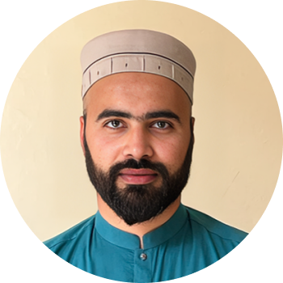

  

  # Osama

  ### I build websites your competitors won't see coming.

  
  
  

 

## Get in touch

- ✉️ **Email** — [madebyosama@gmail.com](mailto:madebyosama@gmail.com)
- 💬 **WhatsApp** — [+92 335 2522522](https://wa.me/923352522522)
- 📞 **Call** — [+92 335 2522522](tel:+923352522522)
- 🌐 **Portfolio** — [portfolio.madebyosama.com](https://portfolio.madebyosama.com)

## Experience

| Company | Role | Years |
| --- | --- | --- |
| **Loqaat** | Founder | 2025 · Now |
| **SolversCave** | Cofounder | 2020 · 2023 |
| **Morosoft** | Website Designer | 2018 · 2019 |

## About

Hey, I'm Osama — a designer and developer who builds fast, distinctive websites for founders and small teams. I care about the details most sites skip: motion, type, and the little moments that make a page feel alive.

Currently building **Loqaat**, and previously cofounded **SolversCave**. When I'm not shipping client work, I'm designing little side tools just for the fun of building something useful.

## Side projects

| Project | Description |
| --- | --- |
| [Clock](https://clock.madebyosama.com) | A minimalist fullscreen browser clock. |
| [Flip Clock](https://flipclock.madebyosama.com) | Timer, stopwatch & alarm. 189 themes, offline. |
| [Scanwell](https://scanwell.madebyosama.com) | Turns phone photos into clean, printable scans. |
| [Lensora](https://lensora.madebyosama.com) | Reverse image search across Lens & Yandex. |
| [Notebook](https://notebook.madebyosama.com) | A minimal notes app. |
| [Workout](https://workout.madebyosama.com) | Workout list with a rest timer & sound. |
| [Merge My PDFs](https://mergemypdfs.madebyosama.com) | Combine PDFs into one file, right in the browser. |
| [Upload](https://upload.madebyosama.com) | Drop a file, get a shareable link back. |

## Pricing

No hidden fees, no subscription. Let's keep it simple.

| Plan | Starting at | Includes |
| --- | --- | --- |
| **Landing page** ⭐ | $1,300 | Figma design, responsive design, dedicated Slack channel, meeting-free (optional), ready in 2 weeks, regular updates |
| **Multiple pages** | $3,000 | Everything in Landing page, plus CMS integration, ready in 2–6 weeks |

Need something custom? [Get in touch](mailto:madebyosama@gmail.com).

## What people say

> "Osama is hands down one of the best WordPress developers I've worked with. He's quick to solve problems."
> — **Sophia Hanvold**, wsdmmarketing.com

> "Working with Muhammad Osama was great. He was accessible and extremely collaborative, and completed all milestones quickly and ahead of schedule."
> — **Akmal Qureshi**, solverscave.com

> "Awesome developer. Always willing to work with you and very professional... We have been doing business for over 5 years."
> — **Adeyinka Adegoke**, melaninpeople.com

## Follow

  
  
  
  
  
  
  

 

  © 2026 Osama

